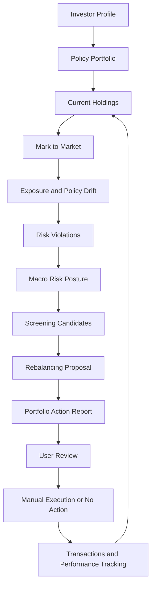
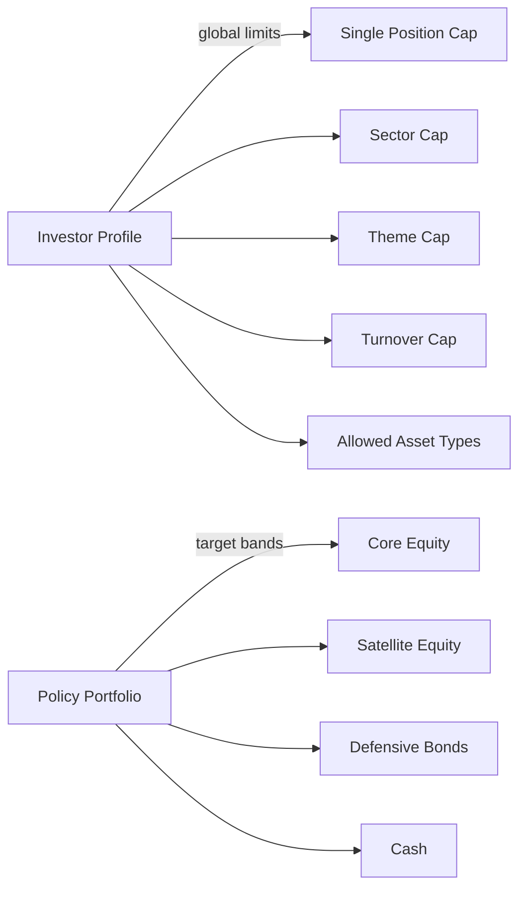
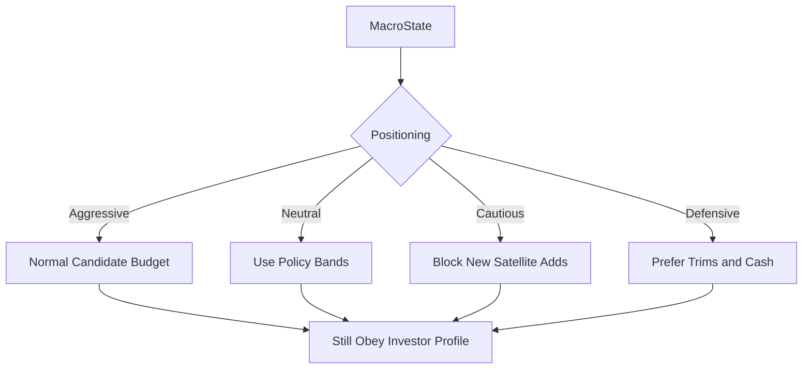
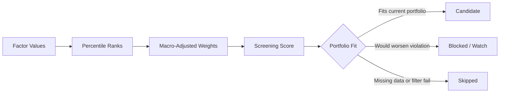
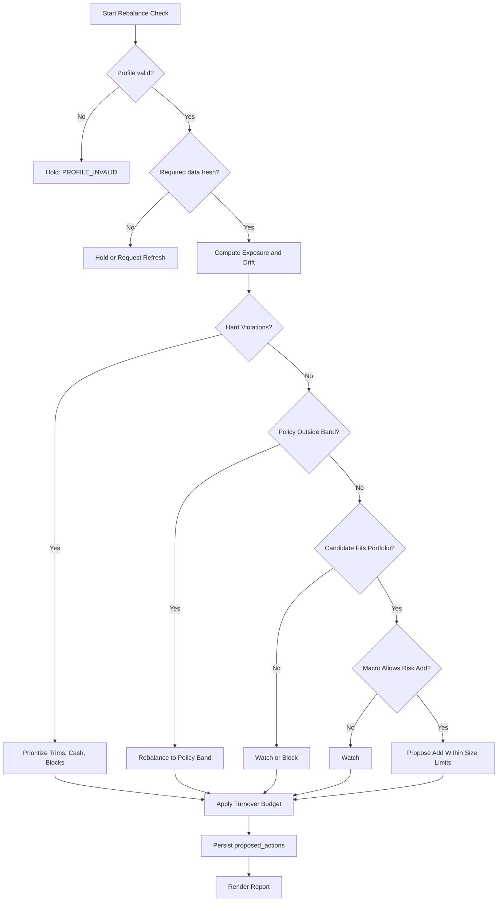

# 포트폴리오 리스크 관리 운영 모델

## 목적

이 문서는 Croesus가 "돈을 지키는 방향"을 구체적으로 어떻게 구현해야 하는지 설명한다.

여기서 돈을 지킨다는 말은 손실을 0으로 만든다는 뜻이 아니다. 투자는 손실 가능성을 없앨 수 없다. Croesus가 해야 할 일은 다음과 같다.

- 한두 번의 잘못된 판단으로 포트폴리오가 회복하기 어려운 수준까지 망가지지 않게 한다.
- 특정 종목, 섹터, 테마, 통화에 과하게 몰리는 것을 감지한다.
- 데이터가 오래됐거나 불완전할 때 잘못된 확신으로 매수/매도 제안을 만들지 않는다.
- 시장 상황이 방어적으로 바뀌었을 때 신규 위험 추가를 줄인다.
- 수익 후보가 좋아 보여도, 현재 포트폴리오에 넣어도 되는지 먼저 검사한다.

따라서 Croesus의 운영 순서는 다음이어야 한다.

1. 투자자 mandate를 정의한다.
2. 정책 포트폴리오를 만든다.
3. 현재 보유자산을 평가한다.
4. 노출과 policy drift를 계산한다.
5. 리스크 위반을 찾는다.
6. MacroState로 현재 risk budget을 조절한다.
7. 후보 자산을 평가한다.
8. 포트폴리오에 맞는 행동만 제안한다.
9. 사용자가 검토한다.
10. 실제 성과와 손실을 추적한다.

수익을 노리는 로직은 이 생존/위험관리 절차를 통과한 뒤에만 의미가 있다.

## 전체 운영 루프



핵심 해석:

- `Investor Profile`은 절대 넘지 말아야 할 외곽 제한이다.
- `Policy Portfolio`는 평소에 유지하고 싶은 목표 비중 지도다.
- `Current Holdings`는 실제로 지금 들고 있는 자산이다.
- `Exposure and Policy Drift`는 현재 포트폴리오가 의도보다 얼마나 위험해졌는지 계산한다.
- `Macro Risk Posture`는 시장 상황에 따라 신규 위험 추가를 조절한다.
- `Screening Candidates`는 후보일 뿐이다. 매수 지시가 아니다.
- `Rebalancing Proposal`은 주문이 아니라 제안이다.
- 사용자가 승인하기 전까지 Croesus는 실행하지 않는다.

## 사용하는 용어와 계산 방식

이 섹션은 Croesus 문서와 코드에서 자주 나오는 투자/계산 용어를 설명한다. 중요한 원칙은 다음이다.

```text
외부 데이터는 수집한다.
계산 가능한 값은 코드로 계산한다.
LLM은 계산값을 만들지 않고 해석과 설명에만 사용한다.
```

### Asset

Asset은 Croesus가 분석하거나 보유자산으로 인식할 수 있는 투자 대상이다.

예시:

```text
AAPL
MSFT
NVDA
SPY ETF
cash row such as CASH_USD
```

현재 Croesus는 `assets` table을 asset universe의 source of truth로 사용한다. 분석 코드에서 ticker list를 직접 하드코딩하면 안 된다.

### Asset universe

Asset universe는 현재 분석 대상이 되는 전체 자산 집합이다.

예시:

```text
US active equities
S&P 500 constituents
NASDAQ 100 constituents
US-listed ETFs
```

현재 common factor 계산은 active US equity를 대상으로 한다.

```text
assets where asset_type = "equity" and country = "US"
```

ETF, bond ETF, option 등은 장기적으로 확장 대상이지만, common factor 계산과 risk engine은 asset type별로 달라져야 한다.

### Ticker와 asset_id

Ticker는 시장에서 쓰는 symbol이다.

```text
AAPL
NVDA
SPY
```

`asset_id`는 Croesus 내부 식별자다.

```text
US_EQ_AAPL
US_EQ_NVDA
CASH_USD
```

같은 ticker라도 국가, 거래소, asset type에 따라 다른 자산일 수 있으므로 내부 로직은 ticker보다 `asset_id`를 기준으로 동작해야 한다.

### OHLCV

OHLCV는 일별 가격 데이터의 기본 형태다.

```text
open   = 해당 거래일 시가
high   = 해당 거래일 고가
low    = 해당 거래일 저가
close  = 해당 거래일 종가
volume = 해당 거래일 거래량
```

Croesus는 가격 데이터를 `prices_daily`에 저장한다.

```text
asset_id
date
open
high
low
close
adjusted_close
volume
source
```

현재 yfinance 기반 가격 수집은 기본적으로 약 1년치 daily price를 가져와 저장한다. Common factor 계산은 현재 `close`와 `volume`을 사용한다.

### Close와 adjusted close

`close`는 그날의 종가다.

`adjusted_close`는 배당, split 같은 corporate action을 반영한 조정 종가다.

현재 common factor 계산은 `close`를 사용한다. 장기 성과나 배당 영향이 중요한 수익률 계산에서는 `adjusted_close`를 사용하는 편이 더 적절할 수 있다. 이 부분은 향후 factor 품질 개선에서 검토해야 한다.

### Market value

Market value는 현재 보유자산의 평가금액이다.

수량 기반 holding:

```text
market_value_i = quantity_i * latest_close_i
```

다른 통화 자산:

```text
base_market_value_i = local_market_value_i * fx_rate_i_to_base
```

수동 입력 holding은 이미 `market_value`가 들어올 수 있다.

### Portfolio value

전체 포트폴리오 평가금액이다.

```text
portfolio_value = sum(base_market_value_i for all holdings)
```

### Weight

Weight는 전체 포트폴리오에서 특정 자산이나 범주가 차지하는 비중이다.

```text
weight_i = market_value_i / portfolio_value
```

예시:

```text
portfolio_value = 100,000
NVDA market_value = 14,000

NVDA weight = 14,000 / 100,000 = 14%
```

### Return

Return은 가격이 얼마나 변했는지 나타내는 수익률이다.

단일 기간 수익률:

```text
return_t = close_t / close_t_minus_1 - 1
```

예시:

```text
yesterday close = 100
today close = 105

return = 105 / 100 - 1 = 5%
```

Croesus의 volatility 계산은 이 daily return series를 사용한다.

### Momentum

Momentum은 최근 일정 기간 동안 가격이 얼마나 올랐는지 또는 내렸는지를 보는 추세 지표다.

직관:

```text
최근 몇 개월 동안 오른 자산은 계속 강할 가능성이 있는가?
최근 몇 개월 동안 약한 자산은 피해야 하는가?
```

Croesus의 현재 common momentum factor:

```text
momentum_1m
momentum_3m
momentum_6m
```

계산식:

```text
momentum_1m = close_today / close_21_trading_days_ago - 1
momentum_3m = close_today / close_63_trading_days_ago - 1
momentum_6m = close_today / close_126_trading_days_ago - 1
```

21, 63, 126은 대략적인 거래일 기준이다.

```text
1개월 ~= 21 trading days
3개월 ~= 63 trading days
6개월 ~= 126 trading days
```

예시:

```text
close_today = 120
close_63_days_ago = 100

momentum_3m = 120 / 100 - 1 = 20%
```

해석:

- 값이 양수면 해당 기간 가격이 상승했다.
- 값이 음수면 해당 기간 가격이 하락했다.
- 값이 높다고 무조건 매수는 아니다. Screening 후보 점수의 일부일 뿐이다.

### Volatility

Volatility는 가격 변동성이 얼마나 큰지 나타낸다. Croesus에서는 위험 penalty로 사용한다.

직관:

```text
같은 기대수익이라면 덜 흔들리는 자산이 더 관리하기 쉽다.
많이 흔들리는 자산은 포트폴리오 drawdown을 키울 수 있다.
```

Croesus의 현재 common volatility factor:

```text
volatility_3m
```

계산식:

```text
daily_return_t = close_t / close_t_minus_1 - 1

volatility_3m
  = standard_deviation(last 63 daily_return values)
```

현재 구현은 63거래일 daily return의 표준편차를 그대로 저장한다. 즉, annualized volatility가 아니다.

Annualized volatility가 필요하면 다음처럼 계산한다.

```text
annualized_volatility = volatility_daily * sqrt(252)
```

여기서 252는 1년의 대략적인 거래일 수다.

예시:

```text
volatility_3m = 0.02
annualized_volatility ~= 0.02 * sqrt(252) ~= 31.7%
```

해석:

- 값이 높을수록 가격 변동이 크다.
- Screening score에서는 volatility percentile에 penalty weight를 곱해서 뺀다.

### Liquidity

Liquidity는 거래가 얼마나 활발한지 나타낸다. 유동성이 낮은 자산은 원하는 가격에 사고팔기 어렵고, 스프레드나 슬리피지가 커질 수 있다.

Croesus의 현재 common liquidity factor:

```text
liquidity_1m
```

계산식:

```text
dollar_volume_t = close_t * volume_t

liquidity_1m
  = average(last 21 dollar_volume values)
```

예시:

```text
close = 100
volume = 1,000,000

dollar_volume = 100 * 1,000,000 = 100,000,000
```

해석:

- 값이 클수록 최근 1개월 동안 거래대금이 컸다는 뜻이다.
- Cautious/Defensive 시장에서는 liquidity 기준을 더 중요하게 볼 수 있다.

### Moving average

Moving average는 일정 기간 가격의 평균이다.

Croesus의 현재 trend factor:

```text
above_200d_ma
```

계산식:

```text
moving_average_200d = average(last 200 close values)

above_200d_ma
  = 1.0 if latest_close > moving_average_200d
    else 0.0
```

해석:

- `1.0`: 현재 가격이 200일 평균보다 높다. 장기 추세가 상대적으로 양호하다고 본다.
- `0.0`: 현재 가격이 200일 평균보다 낮다. 장기 추세가 약하다고 본다.

### Factor

Factor는 투자 판단에 쓰기 위해 코드가 계산한 숫자형 signal이다.

현재 common factor:

```text
momentum_1m
momentum_3m
momentum_6m
volatility_3m
liquidity_1m
above_200d_ma
```

향후 valuation factor:

```text
pe_ratio
pb_ratio
ev_to_ebitda
fcf_yield
price_to_intrinsic
```

중요한 점:

```text
factor value는 LLM이 만들지 않는다.
factor value는 code가 계산해서 factor_values table에 저장한다.
```

### factor_values

`factor_values`는 계산된 factor를 저장하는 long-format table이다.

```text
asset_id
date
factor_name
value
```

예시:

```text
asset_id = US_EQ_NVDA
date = 2026-06-09
factor_name = momentum_3m
value = 0.20
```

이 구조를 쓰는 이유:

- 새 factor를 추가할 때 table column을 추가하지 않아도 된다.
- Screening은 최신 factor 값을 읽어서 percentile rank와 score를 계산할 수 있다.

### Percentile rank

Percentile rank는 raw factor value를 universe 내 상대 순위로 바꾸는 방식이다.

왜 필요한가:

```text
momentum_3m은 -0.2 ~ +0.5 같은 값일 수 있다.
liquidity_1m은 수백만 ~ 수십억 달러일 수 있다.
volatility_3m은 0.01 ~ 0.08 같은 값일 수 있다.
```

단위가 다르기 때문에 raw value를 그대로 더하면 안 된다. 그래서 0부터 1 사이의 상대 점수로 바꾼다.

개념식:

```text
percentile_rank_i = rank_i / (n - 1)
```

해석:

```text
1.0에 가까움 => universe 내 상위권
0.5 근처     => 중간권
0.0에 가까움 => 하위권
```

주의:

Volatility는 percentile이 높다고 좋은 것이 아니다. 변동성이 높은 것이므로 screening score에서는 penalty로 뺀다.

### Screening score

Screening score는 여러 factor를 합쳐 후보 순위를 만드는 점수다.

현재 구조:

```text
momentum_score
  = average(
      percentile(momentum_1m),
      percentile(momentum_3m),
      percentile(momentum_6m)
    )

score
  = w_momentum  * momentum_score
  + w_liquidity * liquidity_score
  + w_trend     * trend_score
  - w_volatility_penalty * volatility_percentile
```

Weight는 MacroState에 따라 조정될 수 있다.

예시:

```text
momentum_score = 0.80
liquidity_score = 0.70
trend_score = 1.00
volatility_percentile = 0.60

w_momentum = 0.35
w_liquidity = 0.25
w_trend = 0.25
w_volatility_penalty = 0.15

score
  = 0.35 * 0.80
  + 0.25 * 0.70
  + 0.25 * 1.00
  - 0.15 * 0.60
  = 0.615
```

이 점수는 "매수 확정"이 아니라 "검토 후보 순위"다.

### Valuation

Valuation은 기업이 현재 비싼지 싼지 평가하는 영역이다.

현재 risk-management Level 1의 핵심 구현은 아니다. Sprint 007에서 본격적으로 구현될 계획이다.

대표 지표:

```text
pe_ratio = price / earnings_per_share
pb_ratio = price / book_value_per_share
ev_to_ebitda = enterprise_value / EBITDA
fcf_yield = free_cash_flow / market_cap
price_to_intrinsic = current_price / DCF_intrinsic_value
```

해석 예시:

```text
price_to_intrinsic < 1
=> DCF 추정 내재가치보다 현재 가격이 낮음

price_to_intrinsic > 1
=> DCF 추정 내재가치보다 현재 가격이 높음
```

주의:

Valuation은 가정에 민감하다. 특히 DCF는 성장률, 할인율, terminal value 가정에 따라 크게 달라진다. 따라서 Croesus는 valuation을 절대 정답이 아니라 action sizing과 watch/block 판단에 쓰는 입력으로 취급해야 한다.

### Drawdown

Drawdown은 이전 고점 대비 현재 얼마나 하락했는지를 나타낸다.

```text
running_peak_t = max(value_0, value_1, ..., value_t)

drawdown_t = value_t / running_peak_t - 1

max_drawdown = min(drawdown_t over all t)
```

예시:

```text
peak = 120,000
current = 96,000

drawdown = 96,000 / 120,000 - 1 = -20%
```

Investor Profile의 `max_tolerable_drawdown`과 비교해서 risk budget을 초과했는지 확인한다.

### Turnover

Turnover는 포트폴리오를 얼마나 많이 갈아엎는지 나타낸다.

Croesus의 현재 monthly turnover budget:

```text
turnover_budget = max_monthly_turnover * portfolio_value
```

제안된 turnover:

```text
proposed_turnover = sum(estimated_trade_value for proposed actions)
```

예시:

```text
portfolio_value = 100,000
max_monthly_turnover = 15%

turnover_budget = 15,000
```

제안된 매매 총액이 15,000을 넘으면 Croesus는 신규 add보다 risk-reduction action을 먼저 남긴다.

### Rebalance band

Rebalance band는 목표 비중에서 어느 정도 벗어날 때 action을 만들지 정하는 허용 폭이다.

예시:

```text
target = 55%
rebalance_band = 5%

허용 범위 = 50% ~ 60%
```

Policy target에 별도 `min_weight`, `max_weight`가 있으면 그 band를 직접 사용한다.

### Exposure

Exposure는 특정 위험 범주에 얼마나 노출되어 있는지를 뜻한다.

예시:

```text
position exposure = NVDA 14%
sector exposure = Technology 41%
theme exposure = AI 32%
currency exposure = USD 95%
```

Exposure는 "내가 무엇에 베팅하고 있는가"를 보여준다.

### Policy drift

Policy drift는 현재 비중이 목표 비중에서 얼마나 벗어났는지 나타낸다.

```text
drift = current_weight - target_weight
```

예시:

```text
target cash = 10%
current cash = 3%

drift = 3% - 10% = -7%
```

### MacroState

MacroState는 시장 전체의 risk posture를 나타내는 상태다.

예시:

```text
Aggressive
Moderately Aggressive
Neutral
Cautious
Defensive
```

MacroState는 trade를 직접 고르지 않는다. 대신 screening weight, candidate count, 신규 satellite add 허용 여부 같은 risk budget을 조절한다.

### Benchmark

Benchmark는 성과 비교 기준이다.

예시:

```text
S&P 500
QQQ
VT
60/30/10 equity/bond/cash policy benchmark
사용자 자신의 policy portfolio benchmark
```

성과 비교:

```text
excess_return = portfolio_return - benchmark_return
```

단, 포트폴리오가 drawdown을 줄이기 위해 cash나 bond를 들고 있다면 S&P 500 하나만 benchmark로 쓰면 왜곡될 수 있다.

### Time-weighted return

Time-weighted return은 입출금 효과를 제거하고 투자 자체의 성과를 보려는 수익률이다.

단일 기간:

```text
period_return_t
  = (value_t - value_t_minus_1 - net_external_cash_flow_t)
    / value_t_minus_1
```

누적:

```text
cumulative_return = product(1 + period_return_t) - 1
```

이 값은 Sprint 006d에서 중요해진다.

### Sharpe ratio

Sharpe ratio는 수익률이 변동성 대비 얼마나 좋은지 보는 진단 지표다.

```text
sharpe_ratio
  = (annualized_return - risk_free_rate) / annualized_volatility
```

해석:

- 높을수록 같은 변동성 대비 수익률이 좋다.
- 단, 과거 데이터 기반 지표이므로 미래 성과를 보장하지 않는다.

### Sortino ratio

Sortino ratio는 Sharpe와 비슷하지만, 전체 변동성이 아니라 하방 변동성만 penalty로 본다.

```text
sortino_ratio
  = (annualized_return - risk_free_rate) / downside_deviation
```

투자자 입장에서는 위로 오르는 변동성보다 아래로 빠지는 변동성이 더 중요하기 때문에, Sortino가 더 직관적일 때가 있다.

### Qualitative research

Qualitative research는 숫자로 바로 계산하기 어려운 정성 분석이다.

예시:

```text
뉴스
실적 발표
SEC filings
경쟁 구도
경영진 발언
규제 리스크
산업 narrative
```

이 영역은 LLM이 도울 수 있다. 하지만 LLM이 factor value, risk metric, portfolio constraint 결과를 계산하면 안 된다.

## 1. Investor Profile: 투자자 mandate

Investor Profile은 다음 질문에 답한다.

> 이 포트폴리오는 어떤 위험까지 감당할 수 있는가?

현재 Croesus의 profile 필드는 다음과 같다.

```text
expected_annual_return
max_tolerable_drawdown
investment_horizon_years
monthly_contribution
liquidity_buffer_months
allowed_asset_types
disallowed_asset_types
max_single_position_weight
max_sector_weight
max_industry_weight
max_theme_weight
max_country_weight
max_currency_weight
max_monthly_turnover
rebalance_band
trade_mode
```

이 값들은 "추천"이 아니라 운영 계약이다.

예를 들어:

```text
max_single_position_weight = 0.10
```

이면, 어떤 종목의 점수가 아무리 좋아도 단일 종목 20% 보유는 허용되지 않는다.

```text
disallowed_asset_types = ["option", "leveraged_etf"]
```

이면, 기대수익이 높아 보여도 옵션이나 레버리지 ETF는 제안하지 않아야 한다.

### Profile 검증

Profile은 action 생성 전에 검증해야 한다.

현재 또는 권장 검증 규칙은 다음과 같다.

```text
expected_annual_return <= 0
=> invalid

max_tolerable_drawdown >= 0
=> invalid

max_tolerable_drawdown > -0.05 and expected_annual_return > 0.08
=> warning: 기대수익률과 허용손실이 비현실적일 수 있음

investment_horizon_years < 1
=> invalid

max_single_position_weight > max_sector_weight
=> warning

rebalance_band <= 0
=> invalid

max_monthly_turnover <= 0
=> invalid

trade_mode == bounded_auto in MVP
=> invalid
```

Profile이 invalid이면 Croesus는 행동을 제안하지 않고 다음과 같은 결과를 내야 한다.

```text
action_type = hold
reason_code = PROFILE_INVALID
```

## 2. Policy Portfolio: 목표 비중 지도

Policy Portfolio는 다음 질문에 답한다.

> 평소에 이 포트폴리오는 어떤 구조를 유지해야 하는가?

예시:

```text
core_equity       target 55%, min 45%, max 65%
satellite_equity  target 15%, min  0%, max 20%
defensive_bonds   target 20%, min 10%, max 30%
cash              target 10%, min  5%, max 20%
```

Investor Profile과 Policy Portfolio는 다르다.

- Investor Profile: 전체 제한이다. 예: 단일 종목 10% 이하, 섹터 35% 이하.
- Policy Portfolio: 목표 구조다. 예: core equity 55%, cash 10%.



좋은 투자 후보를 찾기 전에 Policy Portfolio가 필요한 이유는 간단하다.

> 좋은 자산이라도 현재 포트폴리오에 더 넣으면 위험해질 수 있다.

예를 들어 반도체 기업의 전망이 좋아도 이미 AI/반도체 테마가 40%라면 신규 매수는 좋은 결정이 아닐 수 있다.

## 3. Mark-to-Market: 현재 포트폴리오 가치 계산

모든 리스크 계산은 현재 포트폴리오 가치에서 시작한다.

각 holding의 현지통화 가치:

```text
local_market_value_i = quantity_i * latest_close_i
```

기준통화 가치:

```text
base_market_value_i = local_market_value_i * fx_rate_i_to_base
```

수동 입력으로 `market_value`가 이미 있으면 그 값을 사용할 수 있다.

전체 포트폴리오 가치:

```text
portfolio_value = sum(base_market_value_i for all holdings)
```

각 포지션 비중:

```text
position_weight_i = base_market_value_i / portfolio_value
```

예시:

```text
portfolio_value = 100,000
NVDA market_value = 14,000

NVDA weight = 14,000 / 100,000 = 0.14 = 14%
```

이 값이 틀리면 이후의 모든 판단이 틀어진다. 그래서 가격, FX, holdings snapshot의 freshness가 중요하다.

## 4. Exposure: 실제 노출 계산

Exposure는 다음 질문에 답한다.

> 현재 포트폴리오는 무엇에 얼마나 노출되어 있는가?

현재 Croesus가 계산하는 exposure dimension:

```text
position
sector
industry
theme
country
currency
```

### Position exposure

```text
position_weight(asset A)
  = market_value(A) / portfolio_value
```

### Sector exposure

```text
sector_weight(sector S)
  = sum(market_value_i where sector_i = S) / portfolio_value
```

### Industry exposure

```text
industry_weight(industry I)
  = sum(market_value_i where industry_i = I) / portfolio_value
```

### Country exposure

```text
country_weight(country C)
  = sum(market_value_i where country_i = C) / portfolio_value
```

### Currency exposure

```text
currency_weight(currency X)
  = sum(market_value_i where currency_i = X) / portfolio_value
```

### Theme exposure

```text
theme_weight(theme T)
  = sum(market_value_i where asset_i has theme tag T) / portfolio_value
```

Theme exposure는 합이 100%가 아닐 수 있다. 한 종목이 `ai`, `semiconductor`, `cloud` 같은 여러 theme tag를 동시에 가질 수 있기 때문이다.

### 위반 판단

```text
is_violation = exposure_weight > exposure_limit
```

예시:

```text
NVDA weight = 14%
max_single_position_weight = 10%
=> POSITION_OVER_MAX

Technology sector weight = 41%
max_sector_weight = 35%
=> SECTOR_OVER_MAX
```

## 5. Policy Drift: 목표 비중에서 얼마나 벗어났는가

Policy Drift는 다음 질문에 답한다.

> 현재 포트폴리오는 원래 의도한 allocation map에서 얼마나 벗어났는가?

각 sleeve의 현재 비중:

```text
sleeve_current_weight
  = sum(market_value_i where holding_i maps to sleeve) / portfolio_value
```

Drift:

```text
drift = sleeve_current_weight - sleeve_target_weight
```

Band 위반:

```text
is_outside_band
  = sleeve_current_weight < sleeve_min_weight
    or sleeve_current_weight > sleeve_max_weight
```

예시:

```text
satellite_equity target = 15%
satellite_equity min    =  0%
satellite_equity max    = 20%
current satellite       = 27%

drift = 27% - 15% = +12%
is_outside_band = true because 27% > 20%
```

이 경우 Croesus가 해야 할 일은 "무조건 전부 매도"가 아니다. 더 정확한 행동은 다음 중 하나다.

- 신규 satellite 매수를 막는다.
- 과도한 satellite 포지션 일부를 trim한다.
- cash나 core sleeve 쪽으로 리밸런싱을 제안한다.
- 세금/비용/turnover 제한 때문에 한 번에 조정하지 않고 단계적으로 줄인다.

현재 Level 1에서는 세금 최적화까지는 하지 않는다.

## 6. MacroState: 시장 국면으로 risk budget 조절

MacroState는 다음 질문에 답한다.

> 지금 시장 상황에서 위험을 평소처럼 가져가도 되는가?

MacroState는 종목을 직접 고르지 않는다. 대신 risk posture를 조절한다.

| Macro positioning | Portfolio effect |
|---|---|
| Aggressive | Profile이 허용하는 범위 안에서 정상 또는 상단 risk budget 허용 |
| Moderately Aggressive | 일반적인 candidate add 허용 |
| Neutral | Policy band 그대로 사용 |
| Cautious | 신규 satellite 추가 제한, 유동성/품질 기준 강화 |
| Defensive | concentration 축소, cash 회복, no-action 우선 |



가장 중요한 규칙:

```text
macro_adjusted_limit <= investor_profile_limit
```

MacroState는 제한을 더 보수적으로 만들 수는 있다. 하지만 투자자 profile의 한도를 뚫을 수는 없다.

예시:

```text
Investor Profile: max satellite = 20%
MacroState: Aggressive

허용 가능: satellite를 20%까지 사용
허용 불가: satellite를 30%까지 확대
```

## 7. Screening: 후보 자산 점수 계산

Screening은 다음 질문에 답한다.

> 어떤 자산이 검토할 만한 후보인가?

현재 Croesus의 screening은 deterministic 계산이다. LLM이 점수를 만들지 않는다.

현재 factor:

```text
momentum_1m
momentum_3m
momentum_6m
liquidity_1m
above_200d_ma
volatility_3m
```

### Percentile rank

각 factor 값은 universe 안에서 percentile로 바뀐다.

개념식:

```text
percentile_rank_i = rank_i / (n - 1)
```

결과는 0부터 1 사이 값이다.

- 1에 가까울수록 해당 factor에서 universe 내 상대 순위가 높다.
- 0에 가까울수록 낮다.
- 실제 구현은 missing value와 tie를 deterministic하게 처리해야 한다.

### Momentum score

```text
momentum_score
  = average(
      percentile(momentum_1m),
      percentile(momentum_3m),
      percentile(momentum_6m)
    )
```

### Screening score

```text
score
  = w_momentum  * momentum_score
  + w_liquidity * liquidity_score
  + w_trend     * trend_score
  - w_volatility_penalty * volatility_percentile
```

각 항목:

```text
liquidity_score       = percentile(liquidity_1m)
trend_score           = percentile(above_200d_ma)
volatility_percentile = percentile(volatility_3m)
```

Volatility는 높을수록 위험하다고 보고 penalty로 뺀다.

### 후보는 trade가 아니다

높은 screening score가 바로 매수로 이어지면 안 된다.



후보 상태:

```text
candidate
=> 포트폴리오에 추가 검토 가능

watch
=> 관심은 있지만 지금 action은 아님

blocked_by_portfolio_fit
=> 점수는 좋아도 현재 포트폴리오 위반을 악화시킴

skipped
=> 데이터 부족 또는 필터 탈락
```

## 8. Action Generation: 어떤 행동을 제안할 것인가

Action Generation은 다음 질문에 답한다.

> 지금 실제로 무엇을 제안해야 하는가?

현재 action type:

```text
hold
trim
add
rebalance_to_band
watch
block_new_buy
raise_cash
```

### 8.1 Position trim

단일 포지션이 profile 한도를 넘으면 trim을 제안한다.

```text
excess_weight = current_weight - max_single_position_weight
trade_value   = excess_weight * portfolio_value
proposed_weight = max_single_position_weight
```

예시:

```text
portfolio_value = 100,000
NVDA current    = 14%
max position    = 10%

excess_weight = 14% - 10% = 4%
trade_value   = 4% * 100,000 = 4,000
proposal      = trim NVDA by about 4,000
```

### 8.2 Exposure block

특정 exposure가 한도를 넘으면 해당 영역의 신규 매수를 막는다.

```text
exposure_weight > exposure_limit
=> block_new_buy
```

예시:

```text
Technology sector = 41%
max sector        = 35%
=> block new Technology buys
```

심한 위반이면 trim도 제안할 수 있다.

```text
exposure_weight > exposure_limit + rebalance_band
=> trim largest holding in that exposure
```

예시:

```text
Technology sector = 41%
max sector = 35%
rebalance_band = 5%

41% > 35% + 5%
=> severe overexposure
=> Technology 안에서 가장 큰 holding trim 검토
```

### 8.3 Cash restoration

Cash sleeve가 최소 비중보다 낮으면 cash 회복을 제안한다.

```text
cash_current_weight < cash_min_weight
=> raise_cash
```

제안 금액:

```text
cash_trade_value
  = max(cash_target_weight - cash_current_weight, 0) * portfolio_value
```

예시:

```text
portfolio_value = 100,000
cash current = 3%
cash target = 10%

cash_trade_value = (10% - 3%) * 100,000 = 7,000
```

현재 구현은 policy cash sleeve 기준으로 cash를 회복한다. 미래에는 생활비 또는 실제 필요 유동성 데이터를 기반으로 더 직접적인 liquidity buffer 계산이 필요하다.

### 8.4 Sleeve rebalancing

Sleeve가 max보다 높으면 줄인다.

```text
proposed_weight = min(target_weight, max_weight)
trade_value = (current_weight - proposed_weight) * portfolio_value
```

Sleeve가 min보다 낮으면 늘린다.

```text
proposed_weight = max(target_weight, min_weight)
trade_value = (proposed_weight - current_weight) * portfolio_value
```

예시:

```text
core_equity current = 40%
target = 55%
min = 45%

proposed_weight = max(55%, 45%) = 55%
trade_value = (55% - 40%) * portfolio_value
```

### 8.5 Candidate add sizing

현재 candidate add sizing은 단순하다. 완전한 portfolio optimizer가 아니라 policy sleeve gap을 채우는 방식이다.

Sleeve가 target보다 낮으면:

```text
add_weight = target_weight - current_weight
```

Sleeve가 target 이상이지만 max보다 낮으면:

```text
add_weight = min(max_weight - current_weight, target_weight)
```

추가 여지가 없으면:

```text
add_weight = 0
=> watch, not add
```

미래에 더 안전한 sizing은 다음처럼 가야 한다.

```text
final_add_weight
  = min(
      sleeve_gap,
      single_position_remaining_capacity,
      sector_remaining_capacity,
      industry_remaining_capacity,
      theme_remaining_capacity,
      country_remaining_capacity,
      currency_remaining_capacity,
      macro_risk_budget_remaining,
      turnover_remaining_capacity,
      conviction_based_size
    )
```

각 capacity 예시:

```text
single_position_remaining_capacity
  = max_single_position_weight - current_position_weight

sector_remaining_capacity
  = max_sector_weight - current_sector_weight

turnover_remaining_capacity
  = turnover_budget - already_proposed_trade_value
```

Croesus는 아직 이 full sizing 식을 구현하지 않았다. 현재는 Level 1 proposal용 단순 sizing이다.

### 8.6 Turnover limit

Turnover limit은 너무 많은 매매를 한 번에 하지 않기 위한 제한이다.

월간 turnover budget:

```text
turnover_budget = max_monthly_turnover * portfolio_value
```

현재 제안된 turnover:

```text
proposed_turnover = sum(estimated_trade_value for proposed actions)
```

위반:

```text
proposed_turnover > turnover_budget
```

위반 시 Croesus는 action priority에 따라 더 중요한 행동을 먼저 남긴다.

현재 우선순위:

```text
hold
raise_cash
trim
rebalance_to_band
block_new_buy
watch
add
```

즉, 신규 매수보다 cash 회복과 concentration 축소가 먼저다.

## 9. Data Freshness: 오래된 데이터로 판단하지 않기

이 부분은 계획되어 있지만 아직 완전히 구현되지 않았다. Sprint 006b의 핵심이다.

Croesus는 다음 freshness 값을 계산해야 한다.

```text
price_age_days
  = today - latest_price_date

fx_age_days
  = today - latest_fx_date

macro_age_days
  = today - latest_macro_date

snapshot_age_days
  = today - latest_portfolio_snapshot_date

screening_age_days
  = today - latest_screening_run_date
```

권장 halt rule:

```text
if price_age_days > allowed_price_lag:
    block add/trim proposals
    request price refresh

if fx_age_days > allowed_fx_lag:
    block multi-currency actions
    request FX refresh

if snapshot_age_days > allowed_snapshot_lag:
    block rebalance_check
    request holdings refresh

if macro_age_days > allowed_macro_lag:
    use neutral macro posture or request macro refresh
```

Freshness는 단순한 UX 문제가 아니다. 오래된 데이터로 action을 만들면 리스크 관리가 무너진다.

## 10. Performance와 Drawdown 추적

이 부분은 Sprint 006d에서 계획되어 있다. Croesus가 실제로 돈을 지키고 있는지 확인하려면 반드시 필요하다.

### 10.1 입출금 제외 투자수익률

입금액을 수익으로 착각하면 안 된다.

단일 기간 수익률:

```text
period_return_t
  = (value_t - value_t_minus_1 - net_external_cash_flow_t)
    / value_t_minus_1
```

외부 현금흐름:

```text
net_external_cash_flow_t = deposits_t - withdrawals_t
```

누적 time-weighted return:

```text
cumulative_return
  = product(1 + period_return_t) - 1
```

이 값은 다음 질문에 답한다.

> 내가 새 돈을 넣어서 잔고가 늘어난 것인가, 아니면 투자 자체가 잘 된 것인가?

### 10.2 Drawdown

Drawdown은 이전 고점 대비 손실이다.

```text
running_peak_t = max(value_0, value_1, ..., value_t)

drawdown_t = (value_t / running_peak_t) - 1

max_drawdown = min(drawdown_t over all t)
```

Profile 위반:

```text
max_drawdown < max_tolerable_drawdown
=> risk budget breach
```

예시:

```text
peak value = 120,000
current value = 96,000

drawdown = 96,000 / 120,000 - 1 = -20%
```

만약 profile의 `max_tolerable_drawdown = -15%`라면, 이 포트폴리오는 사용자가 정한 손실 허용치를 이미 넘은 것이다.

### 10.3 Benchmark 비교

시장 대비 성과:

```text
excess_return = portfolio_return - benchmark_return
```

가능한 benchmark:

```text
S&P 500
QQQ 또는 growth benchmark
VT 또는 global equity benchmark
60/30/10 equity/bond/cash policy benchmark
사용자 자신의 policy portfolio benchmark
```

중요한 점:

> S&P 500만 benchmark로 쓰면 안 된다.

포트폴리오가 의도적으로 cash와 bond를 들고 drawdown을 줄이는 구조라면, 상승장에서 S&P 500보다 낮은 수익률은 실패가 아닐 수 있다. 이 경우 "수익률은 낮았지만 drawdown을 의도대로 줄였는가"를 같이 봐야 한다.

### 10.4 Risk-adjusted return

기본 식:

```text
annualized_volatility
  = standard_deviation(period_returns) * sqrt(periods_per_year)

sharpe_ratio
  = (annualized_return - risk_free_rate) / annualized_volatility

sortino_ratio
  = (annualized_return - risk_free_rate) / downside_deviation
```

이 값들은 보조 진단 지표다. 미래 수익을 보장하지 않는다.

## Decision Ladder

Croesus는 action을 다음 순서로 판단해야 한다.



이 순서가 중요한 이유는 다음과 같다.

> 좋은 후보를 찾는 것보다, 그 후보가 현재 포트폴리오를 망치지 않는지 먼저 확인해야 한다.

## 현재 구현 상태

| Layer | Status | Notes |
|---|---|---|
| Investor profile | 구현됨 | Profile 저장, 제한조건, validation |
| Policy portfolio | 구현됨 | Target sleeve와 min/max band |
| Holdings snapshot | 구현됨 | 수동 holdings import와 snapshot |
| FX / mark-to-market | 구현됨 | 현재가 평가, FX, unrealized P&L |
| Exposure calculation | 구현됨 | Position, sector, industry, theme, country, currency |
| Policy drift | 구현됨 | Sleeve current/target/min/max/drift |
| Macro risk posture | 구현됨 | MacroState가 screening/rebalancing posture에 반영 |
| Screening | 구현됨 | Percentile factor score와 portfolio-fit overlay |
| Rebalancing proposal | 구현됨 | Proposal-only actions와 reason codes |
| Portfolio action report | 구현됨 | Persisted actions 기반 Markdown/CSV report |
| Data freshness | 계획됨 | Sprint 006b |
| Transaction ledger | 계획됨 | Sprint 006c |
| Performance / goal tracking | 계획됨 | Sprint 006d |
| Valuation layer | 계획됨 | Sprint 007 |
| Research Agent | 계획됨 | Sprint 008 |
| Approval-based execution | 계획됨 | Sprint 009 |
| Bounded automation | 계획됨 | Sprint 010 |

## Croesus가 "돈을 지킨다"는 것의 체크리스트

Croesus는 수익 후보를 제안하기 전에 다음 질문에 답해야 한다.

1. Investor Profile이 valid한가?
2. 현재 portfolio value를 믿을 수 있는가?
3. 단일 종목이 너무 큰가?
4. 특정 sector, industry, theme, country, currency에 몰려 있는가?
5. Cash가 policy minimum보다 낮은가?
6. Portfolio가 policy band 밖으로 drift 되었는가?
7. 시장 국면이 cautious 또는 defensive인가?
8. 후보 자산이 기존 위반을 악화시키는가?
9. 제안된 행동이 monthly turnover를 초과하는가?
10. 가격, FX, macro, snapshot, screening 데이터가 충분히 최신인가?
11. Drawdown이 사용자의 허용손실 안에 있는가?
12. 입출금을 제외하고 실제 투자 성과가 개선되고 있는가?

현재 Level 1 구현은 1부터 9까지를 상당 부분 처리한다. 10부터 12는 006b, 006c, 006d에서 닫아야 한다.

## 예시 시나리오

입력:

```text
portfolio_value = 100,000
max_single_position_weight = 10%
max_sector_weight = 35%
max_monthly_turnover = 15%
rebalance_band = 5%

NVDA weight = 14%
Technology sector weight = 41%
Cash sleeve current = 3%
Cash sleeve target = 10%
Cash sleeve min = 5%
Macro positioning = Cautious
```

Croesus 제안:

```text
1. trim NVDA
   reason: POSITION_OVER_MAX
   estimated value: (14% - 10%) * 100,000 = 4,000

2. block new Technology buys
   reason: SECTOR_OVER_MAX

3. raise cash
   reason: CASH_BELOW_BUFFER
   estimated value: (10% - 3%) * 100,000 = 7,000

4. watch high-scoring satellite candidates
   reason: MACRO_CAUTIOUS_TIGHTEN_RISK
```

Turnover budget:

```text
turnover_budget = 15% * 100,000 = 15,000
```

제안된 trade value:

```text
4,000 + 7,000 = 11,000
```

따라서 turnover budget 안에 있다.

만약 추가 candidate add가 10,000 더 있었다면:

```text
total proposed trade value = 21,000
turnover budget = 15,000
```

이 경우 Croesus는 신규 add를 줄이거나 보류하고, cash 회복과 concentration 축소를 먼저 남겨야 한다.

## 최종 원칙

Croesus는 세 질문을 분리해야 한다.

```text
Can I survive this portfolio?
Is this portfolio aligned with my policy?
Is this candidate worth adding?
```

순서가 중요하다.

```text
Survival first.
Policy alignment second.
Return seeking third.
```

좋은 후보를 찾는 것은 필요하다. 하지만 좋은 후보를 찾는 능력만으로는 돈을 지킬 수 없다. Croesus가 먼저 완성해야 하는 것은 "내 포트폴리오가 감당 가능한 위험 안에서 움직이고 있는가"를 계속 측정하고, 벗어나면 행동을 제안하는 운영 루프다.
